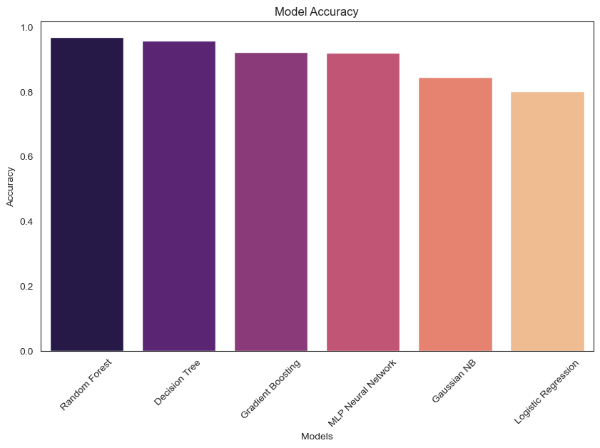

# Fatin Yasin Portfolio
Here is a collection of my data science projects, click on the titles to be directed to the appropriate repositories.

# [Wind Turbine Rated Capacity Predictor](https://github.com/fatinys/windturbine-optimization)
Create a model to predict the energy capacity for a turbine given its location.
Provide optimal zones in Texas that show potential for efficient wind farm projects.

)

# [Predictive Maintenance Classifier Project](https://github.com/fatinys/Predictive-Mainenance)
In this project I trained and finetuned a various amount of models to predict parameters for which a milling machine was a risk for machine failure. 

