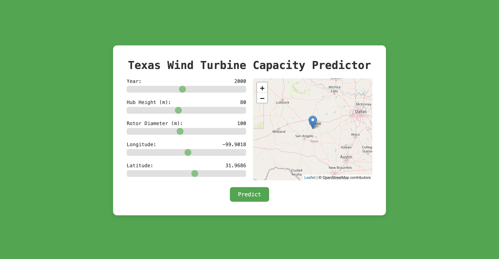

# My Portfolio - Fatin Yasin

# [Wind Turbine Rated Capacity Predictor](https://github.com/fatinys/windturbine-optimization)
Created a model to predict the energy capacity for a turbine given its location.
Provide optimal zones in Texas that show potential for efficient wind farm projects.

# [Predictive Maintenance Classifier Project](https://github.com/fatinys/Predictive-Mainenance)
Balanced highly imbalanced dataset with SMOTE to achieve an accuracy of 96% on machine risk classification with Random Forest

# [GRIDWISE](https://github.com/fatinys/gridwise)
GOAL: Create an end to end pipeline to forecast ERCOT Electricity demand (hourly/day ahead) using historical load and weather data.

# [Clustering - Drowsiness Detection](https://github.com/fatinys/FY_portfolio/blob/c2abbfc91f4c903e216db5b26acabacb0e244988/Final%20Project_%20GMM.pdf)
Applied Gaussian Mixture Models (GMM) to classify EEG signals for drowsiness detection; optimized hyperparameters to achieve 11% improvement over baseline
